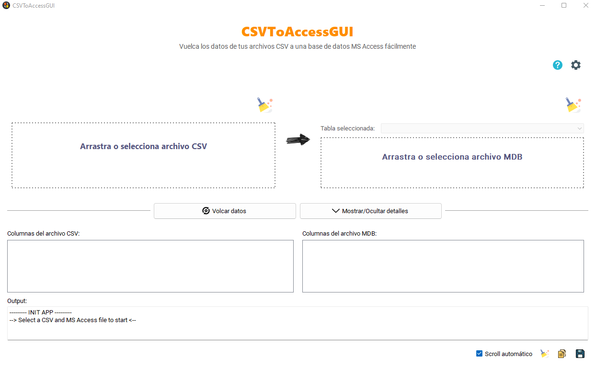
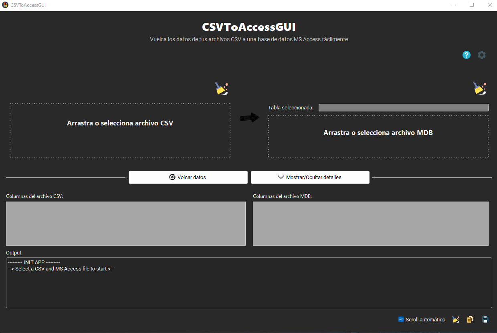
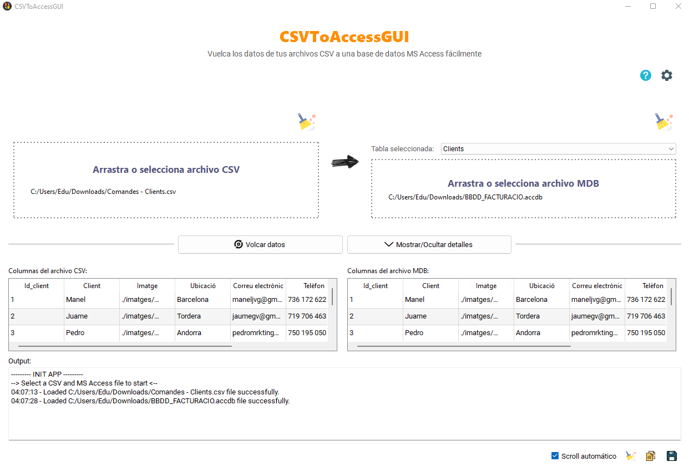

# CSVToAccessGUI

Graphical interface for CSVToAccess python script. This program allows users to extract data from a CSV file and dump it directly to a MS Access table easily just like [CSVToAccess](https://github.com/caicesardev/CSVToAccess) does but with a new intuitive graphical user interface.

Report any bugs directly to me or open an [issue](https://github.com/caicesardev/CSVToAccessGUI/issues/).

> Still need to fix some issues:
:small_orange_diamond: [Fix translations](https://github.com/caicesardev/CSVToAccessGUI/issues/2)

Light theme            |  Dark theme
:-------------------------:|:-------------------------:
  |  
---

_* All data in these tables are for sample purposes only and doesn't represent real persons._
